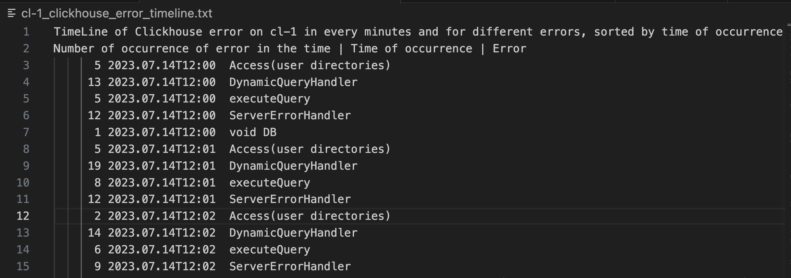
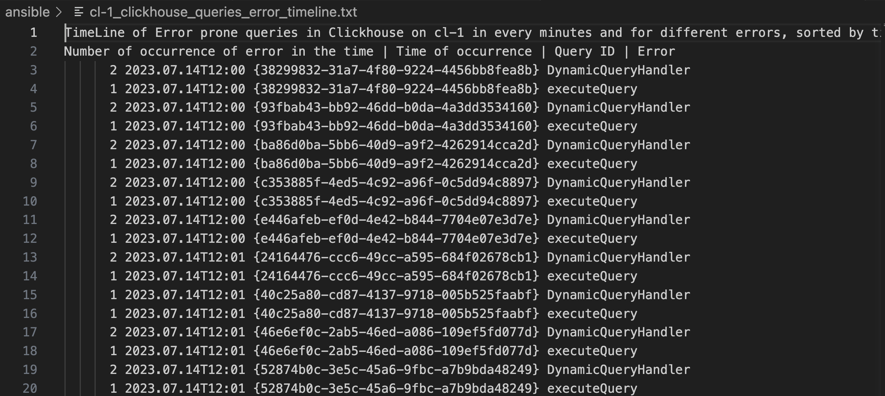
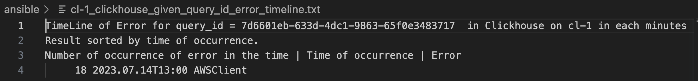
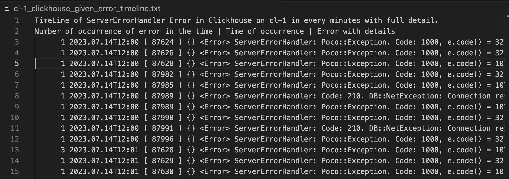

# ClickSight (Get Insight from Clickhouse Error log)

Clickhouse log aggregation using Ansible

## Usage

First Clone the project :)

```bash
git clone https://github.com/anvaari/ClickSight.git
cd ClickSight
```

### Perquisites

1. Prepare Inventory file and Servers

- Edit [hosts](./hosts) and replace `{node-1-address}` and `{node-2-address}` with  Clickhouse addresses.
  - You can use either the name or the IPv4 or IPv6 address.
  - This playbook suppose Clickhouse error log place in `/var/log/clickhouse-server/clickhouse-server.err.log`.
    - If it's different in your case, open issue to provide option to get it as variable.
- Also replace `{user}` with user which have sudo access on Clickhouse servers.
  - Sudo user needed in case of `{user}` hasn't read permission to read `/var/log/clickhouse-server.err.log`. If it has, you can remove all `become: true` from playbook and remove `-K` from command.
- It's better to add your public key to authorized_key of Clickhouse servers so you don't need to enter password every time. [See how](https://linuxhandbook.com/add-ssh-public-key-to-server/)

2.Install `Ansible`

You can Install it using [official document](https://docs.ansible.com/ansible/latest/installation_guide/intro_installation.html). This playbook developed by Ansible core 2.15.0. And recommended to use this version.

### Run ClickSight

ClickSight works in five mode for each node:

#### `fatal`

Timeline of all Fatal Errors in `clickhouse-server.error.log`.

- Variables:
  - `mode`: For this, mode must be `fatal`. Default = `fatal`
  - `lines_after`: Control number of lines you want to see after the line contains `<Fatal>`. Default = 20
- **Usage**:

  Show `Fatal` logs and 35 lines after it.

  ```bash
  ansible-playbook -K -i hosts click-sight-playbook.yaml -e '{"mode":"fatal","lines_after":"35"}'
  ```

  **Notes:**
  - Result will save in `{clickhouse_node_name}_clickhouse_fatal_errors.txt`
  - You need enter `{user}` password after executing command

#### `error_timeline`

Timeline of `Error` log in `clickhouse-server.err.log` from `from_datetime`


- Variables:
  - `mode`: For this, mode must be `error_timeline`. Default = `fatal`
  - `from_datetime`: Log after this time will aggregate and show. Default = 2 hours before now
    - Format must be `YYYY.MM.DD HH:MM`
    - **Important**: If there isn't any `<Error>` in given time, result will be empty so try to provide broad range like `2023.07.14 15` (It search for error which its line starts with `2023.07.14 15` So most likely there is error in that hour. But if you provide `2023.07.14 15:00`, it's more likely to there isn't any Error in that minute, so result will be empty!)
- **Usage**:
  Show `Error` logs from `2023-07-14 12:00`

  ```bash
  ansible-playbook -K -i hosts click-sight-playbook.yaml -e '{"mode":"error_timeline","from_datetime":"2023.07.14 12"}'
  ```

  **Notes:**
  - Result will save in `{clickhouse_node_name}_clickhouse_error_timeline.txt`
  - Result will group by minutes and sorted by time of occurrence

#### `queries_error_timeline`

Timeline of errors associated with `query_id` from `from_datetime`

  
- Variables:
  - `mode`: For this, mode must be `queries_error_timeline`. Default = `fatal`
  - `from_datetime`: See detail of this variable in documentation of mode = [error_timeline](#error_timeline)
- **Usage**:
  Show `Error` logs associated with `query_id` from `2023-07-14 12:00`

  ```bash
  ansible-playbook -K -i hosts click-sight-playbook.yaml -e '{"mode":"queries_error_timeline","from_datetime":"2023.07.14 12"}'
  ```

  **Notes:**
  - Result will save in `{clickhouse_node_name}_clickhouse_queries_error_timeline.txt`
  - Result will group by minutes and sorted by time of occurrence
  - You can see full detail about specific `query_id` by executing this query in `{clickhouse_node_name}` : `select * from system.query_log where query_id = {query_id}`

#### `given_query_id_error_timeline`

Timeline of all errors associated with given `query_id` from `from_datetime`

  
- Variables:
  - `mode`: For this, mode must be `given_query_id_error_timeline`. Default = `fatal`
  - `query_id`: query_id you want to have its error timeline. You can get one (`query_id`) from mode = `queries_error_timeline`. Default = "" (Default will show all `Error` level logs which not associated with specific query)
    - Note that `query_id` from node_x only valid for this node. You can't rely on result in another node (query is different in that node)
  - `from_datetime`: See detail of this variable in documentation of mode = [error_timeline](#error_timeline)
- **Usage**:
  Show all `Error` level logs for `7d6601eb-633d-4dc1-9863-65f0e3483717` query in `cl-1` from `2023-07-14 12:00`

  ```bash
  ansible-playbook -K -i hosts -l cl-1 click-disaster-playbook.yaml -e '{"mode":"given_query_id_error_timeline","from_datetime":"2023.07.14 12","query_id":"7d6601eb-633d-4dc1-9863-65f0e3483717"}'
  ```

  **Notes:**
  - Result will save in `cl-1_clickhouse_given_query_id_error_timeline.txt`
  - Result will group by minutes and sorted by time of occurrence
  - You can see full detail about this `query_id` by executing this query in node-1 : `select * from system.query_log where query_id = 7d6601eb-633d-4dc1-9863-65f0e3483717`

#### `given_error_timeline`

Timeline of given error from `from_datetime` with more detail (contains full error line)

  
- Variables:
  - `mode`: For this, mode must be `given_error_timeline`. Default = `fatal`
  - `error`: Error you want to have its timeline with full detail. You can get one from mode = `error_timeline`. Default = "StorageKafka"
  - `from_datetime`: See detail of this variable in documentation of mode = [error_timeline](#error_timeline)
- **Usage**:
  Show all logs which its error is `ServerErrorHandler` from `2023-07-14 12:00` with more detail.

  ```bash
  ansible-playbook -K -i hosts click-sight-playbook.yaml -e '{"mode":"given_error_timeline","from_datetime":"2023.07.14 12","error":"ServerErrorHandler"}'
  ```

  **Notes:**
  - Result save in `{clickhouse_node_name}_clickhouse_given_error_timeline.txt`
  - Result not grouped but sorted by time of occurrence
